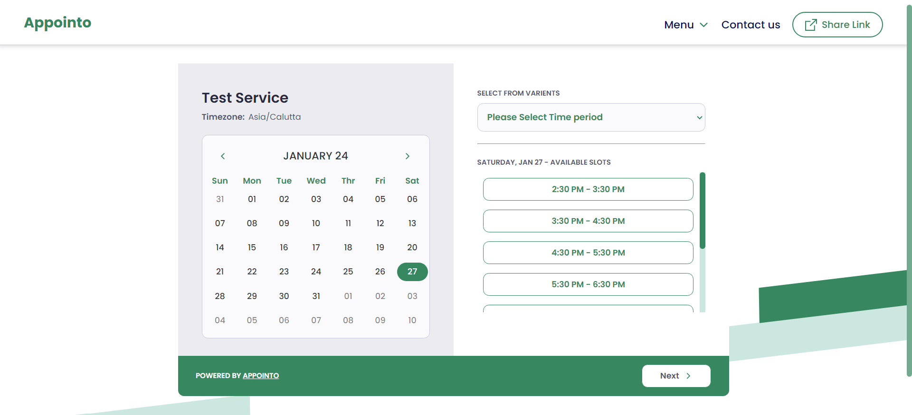

# Appointo

A dynamic appointment booking screen using React.
## Live project: [Appointo](https://appointment-booking-screen.netlify.app/)


### Tech Stack :    

- **Frontend:** HTML, CSS, JavaScript, React
- **Version Control:** Git and GitHub
- **Hosting:** Netlify
- **Code Editor and tools:** VS Code
- React Hot Toast
- React Icons

### Features:
 - Calendar View: Users can easily navigate through calender and view dates.

- Loading Feedback: Implemented loading spinner to provide users with feedback while data is being fetched.

- Date Selection: Users can select a date to view and book available timeslots for that specific day.

- Appointment Booking: Users after chooseing an timeslot can  proceed to book an appointment by clicking in next button.

- Error Handling: Implemented robust error handling to gracefully handle issues, providing clear feedback to users when they have proceeded to book an appointment either without selecting time duration for appointment or without selecting the time slot or both. 
<br/>
A toast message will appear telling user about the error.
- After booking an appointment by clicking on the next button a toast message will appear telling users whot appointment they are booking.

### How to install and run locally:
1. Clone the repository:
   ```
   $ git clone https://github.com/prthmh/appointment_booking.git
   ```
2. Navigate to the project directory:
   ```
   $ cd appointment_booking
   ```
3. Install the required dependencies:
   ```
   $ npm install
   ```
4. Start the app:
   ```
    $ npm run dev
   ```